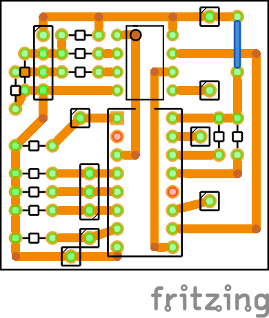

Adaptadores de Joystick antiguos a USB con Attiny85

Requiere
========

* 1 Attiny85
* 2 Diodos zener 3V6
* 1 Resistencia 1,5KΩ 1/4W 
* 2 Resistencia 68Ω 1/4W
* 10 Resistencias de 10KΩ (para sega)
* 1 CD4021 (para sega)
* 1 DB9 o DB15 macho
* 1 puerto USB macho

<a href="https://maquinaslibres.noblogs.org/joystick-retros/">¡Comprar uno!</a>

Quehaceres
==========

* imagenes con los diferentes puertos y como se conectan
* guía de armado con fotos o video

-- 

**Donar Bitcoin:** 19qkh5dNVxL58o5hh6hLsK64PwEtEXVHXs
