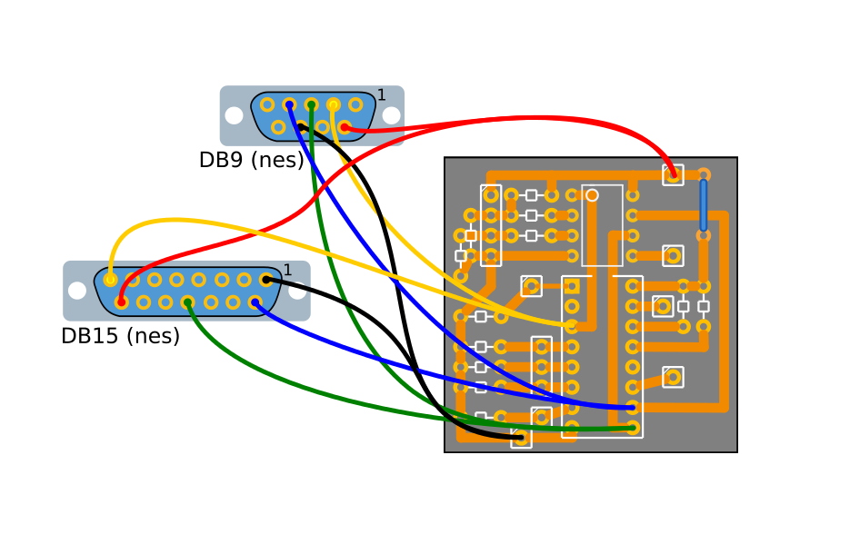

Adaptadores de Joystick antiguos a USB con Attiny85

Requiere
========

* 1 Attiny85
* 2 Diodos zener 3V6
* 1 Resistencia 1,5KΩ 1/4W 
* 2 Resistencia 68Ω 1/4W
* 10 Resistencias de 10KΩ (para sega)
* 1 CD4021 (para sega)
* 1 DB9 o DB15 macho
* 1 puerto USB macho

<a href="https://maquinaslibres.noblogs.org/joystick-retros/">¡Comprar uno!</a>

* [Fotos del armado](https://maquinaslibres.noblogs.org/kit-de-armado-de-digijoystick/)

Conexiones del DB9 de sega
--------------------------

Conexiones del DB9 de nes, famicom, familygame
--------------------------

-- 

**Donar Bitcoin:** 19qkh5dNVxL58o5hh6hLsK64PwEtEXVHXs    
**PayPal:** [Ayudanos a mejorar desde $1](https://www.paypal.com/cgi-bin/webscr?cmd=_s-xclick&hosted_button_id=JMFARRBCYTFG8)

